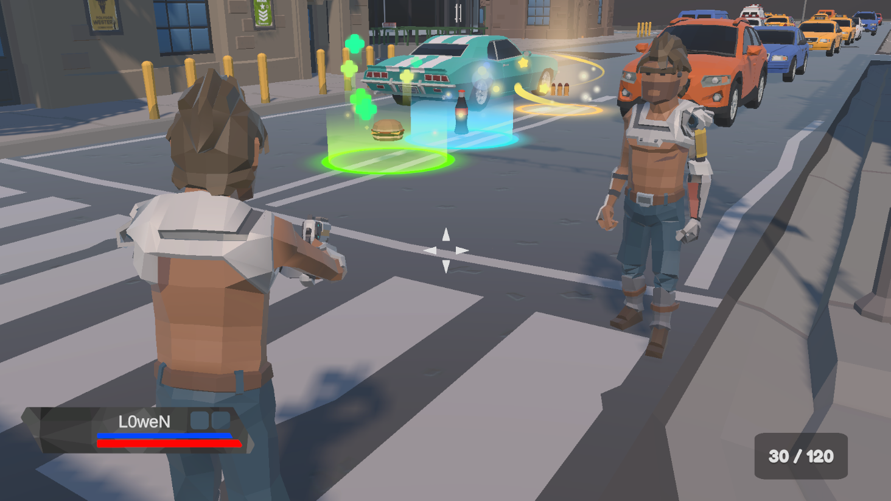
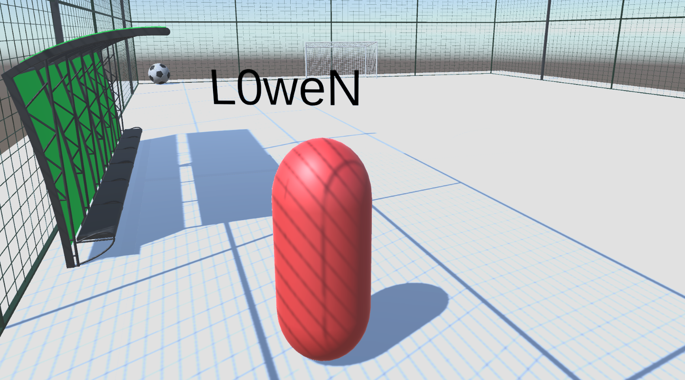
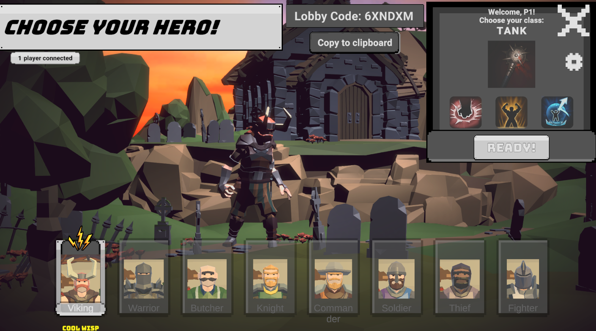
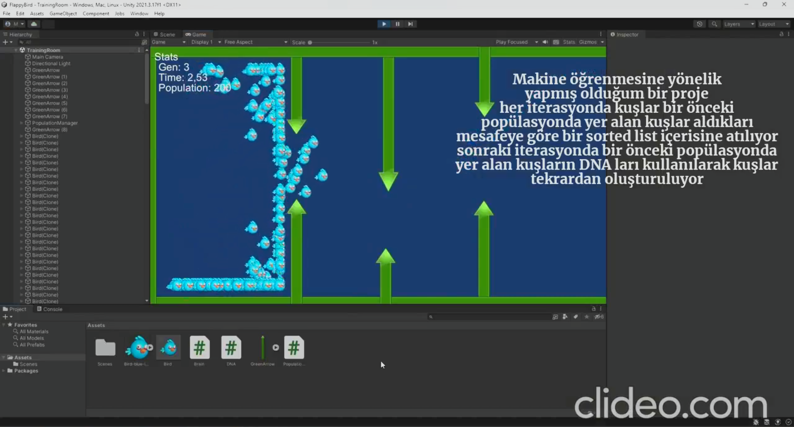
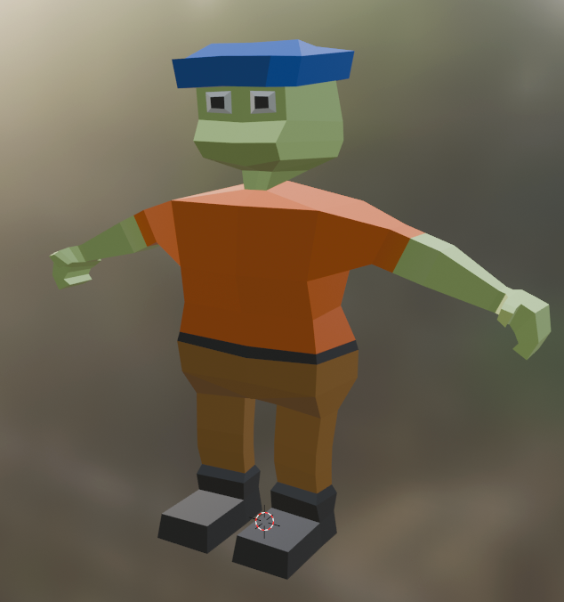
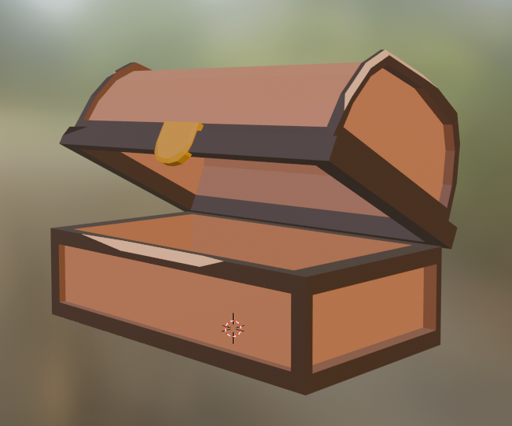

<!DOCTYPE html>
<html lang="en-EN">
  <head>
    <meta charset="UTF-8">
    <meta http-equiv="X-UA-Compatible" content="IE=edge">
    <meta name="viewport" content="width=device-width, initial-scale=1">
    <title>Mert Özata</title>
    <link rel="icon" href="images/Logo.png" type="image/x-icon" />
    <link href="https://fonts.googleapis.com/css?family=Montserrat:400,700,200" rel="stylesheet">
    <link href="https://maxcdn.bootstrapcdn.com/font-awesome/latest/css/font-awesome.min.css" rel="stylesheet">
    <link rel="stylesheet" href="https://cdn.jsdelivr.net/npm/bootstrap-icons@1.9.1/font/bootstrap-icons.css">
    
    <link href="css/aos.css" rel="stylesheet">
    <link href="css/bootstrap.min.css" rel="stylesheet">
    <link href="css/style.css" rel="stylesheet">
  </head>
  <body id="top">
    <header>
      

        <nav class="navbar navbar-expand-lg fixed-top navbar-transparent bg-navbar" color-on-scroll="400">
          

            

              <button class="navbar-toggler navbar-toggler" type="button" data-toggle="collapse" data-target="#navigation" aria-controls="navigation" aria-expanded="false" aria-label="Toggle navigation"></button>
            

            

              <ul class="navbar-nav">
                <li class="nav-item"><a class="nav-link smooth-scroll" href="#about">About</a></li>
                <li class="nav-item"><a class="nav-link smooth-scroll" href="#skill">Skill</a></li>
                <li class="nav-item"><a class="nav-link smooth-scroll" href="#portfolio">Portfolio</a></li>
                <li class="nav-item"><a class="nav-link smooth-scroll" href="#education">Education</a></li>
                <li class="nav-item"><a class="nav-link smooth-scroll" href="#certificates">Certificates</a></li>
                <li class="nav-item"><a class="nav-link smooth-scroll" href="#contact">Contact</a></li>
              </ul>
            

          

        </nav>
      

    </header>
    

      

  

    

      

      

        

          

          
Hamza Mert Özata

          
Software Developer

        

      

    

  

  

    

      

        

          

            
<i class="fa-solid fa-user-secret"></i> About Me

            
Hello.

            

            I am Hamza Mert Özata, a graduate of Manisa Celal Bayar University. I possess strong competence in Multiplayer Games and AI.
            I am determined to contribute to successful projects in the Multiplayer Games with my analytical thinking, communication skills, and teamwork abilities.
            I am eager to elaborate on my interest in be game developer and discuss how my skills align with your team's needs.
            

          

      

    

  

  

    

      

        

          

            
<i class="fa-solid fa-address-card"></i> Personal information

            

              
<strong class="text-uppercase"><i class="fa fa-info-circle" aria-hidden="true"></i> Age:</strong>

              
23

            

            

              
<strong class="text-uppercase"><i class="fa fa-map-marker" aria-hidden="true"></i> City:</strong>

              
Antalya

            

            

              
<strong class="text-uppercase">Languages:</strong>

              
English(Pre-Intermediate)

            

            

              
<strong class="text-uppercase"><i class="fa fa-google-plus" aria-hidden="true"></i> Mail:</strong>

              
hamzamertozata@gmail.com

            

          

        

          

            

              
<i class="fa-regular fa-address-card"></i> General information

              

                
<strong class="text-uppercase"><i class="fa fa-book" aria-hidden="true"></i> Hobbies:</strong>

                
Bicycles, Cinema, Books

              

              

                
<strong class="text-uppercase"><i class="fa fa-question-circle-o" aria-hidden="true"></i> Interest:</strong>

                
Games, AI, Cars, Motorcycles

              

            

          

        

        

      

    

  

  

    
<i class="fa-solid fa-laptop-code"></i> Skills

    

      

        

          

            
<i class="fa fa-windows" aria-hidden="true"></i> C#
              

                

90%
              

              

              
<i class="fa fa-chevron-right" aria-hidden="true"></i> Knowledge of OOP,

                
<i class="fa fa-chevron-right" aria-hidden="true"></i> Knowledge of S.O.L.I.D principles,

                
<i class="fa fa-chevron-right" aria-hidden="true"></i> Command of design patterns.

              

            

          

          

            
<i class="bi bi-unity"></i> Unity
              

                

80%
              

              

                
<i class="fa fa-chevron-right" aria-hidden="true"></i> 2D, 3D Hyper casual game development experience,

                
<i class="fa fa-chevron-right" aria-hidden="true"></i> Multiplayer game development experience,

                
<i class="fa fa-chevron-right" aria-hidden="true"></i> Experience developing game AI.

              

            

          

        

        

          

            
<i class="fa-brands fa-python"></i> Python
              

                

75%
              

              

                
<i class="fa fa-chevron-right" aria-hidden="true"></i> Projects in machine learning and deep learning.

              

            

          

          

            
<i class="fa-solid fa-blender"></i> Blender
              

                

50%
              

              

                
<i class="fa fa-chevron-right" aria-hidden="true"></i> Low Poly design capability.

              

            

          

        

        

          

            
<i class="bi bi-git"></i> GIT
              

                

80%
              

              

                
<i class="fa fa-chevron-right" aria-hidden="true"></i> Experience developing projects with multiple team members.

              

            

          

          

            
<i class="fa-solid fa-cat"></i> Cascadeur
              

                

20%
              

              

                
<i class="fa fa-chevron-right" aria-hidden="true"></i> Simple animation development experience.

              

            

          

        

      

    

  

    

      

        

          
<i class="fa fa-table" aria-hidden="true"></i> Portfolio

          

            <ul class="nav nav-pills nav-pills-primary" role="tablist">
              <li class="nav-item"><a class="nav-link active" data-toggle="tab" href="#first-page" role="tablist"><i class="fa-brands fa-unity"></i></a></li>
              <li class="nav-item"><a class="nav-link" data-toggle="tab" href="#second-page" role="tablist"><i class="fa-solid fa-blender"></i></a></li>
            </ul>
          

        

      

      

        

          

            

              

                
<a href=https://youtu.be/RjM1NE9pQX0>
                    <figure class="cc-effect">
                      <figcaption>
                        
Trail Of War

                        
Multiplayer Third Person Shooter

                      </figcaption>
                    </figure></a>

              

              

                

                    <figure class="cc-effect">
                      <figcaption>
                        
Haxball 3D(Working Title)

                        
Multiplayer Haxball but 3D

                      </figcaption>
                    </figure></a>

              

              

                
<a href=https://youtu.be/YO6W9eEDgXo>
                    <figure class="cc-effect">
                      <figcaption>
                        
Coop Fight Simulator

                        
Multiplayer Fight game

                      </figcaption>
                    </figure></a>

              

              

                
<a href=https://youtu.be/ecjKTSfbUOU>
                    <figure class="cc-effect">
                      <figcaption>
                        
General projects

                        
Some projects

                      </figcaption>
                    </figure></a>

              

            

          

        

        

          

            

              

                

                    <figure class="cc-effect">
                      <figcaption>
                        
Low Poly

                        
Characters

                      </figcaption>
                    </figure></a>

              

              

                

                    <figure class="cc-effect">
                      <figcaption>
                        
Low Poly

                        
Environment

                      </figcaption>
                    </figure></a>

              

            

          

        

    

  

  

    
<i class="fa fa-graduation-cap" aria-hidden="true"></i> Education

    

      

        

          

            
Manisa Celal Bayar University

          

        

        

          

            
Software Engineer

            
2019 - 2023

            
Manisa Celal Bayar University, Faculty of Engineering, Department of Software Engineering. CGPA: 3,1

          

        

      

    

    

      

        

          

            
Şehit Abdullah Ümit Sercan Anatolian High School

          

        

        

          

            
2015-2019

            
Şehit Abdullah Ümit Sercan Anatolian High School, Science and Mathematics

          

        

      

    

  

    

      
<i class="fa-solid fa-certificate"></i> Certificates

      

        

          <ol class="carousel-indicators">
            <li class="active" data-target="#cc-Indicators" data-slide-to="0"></li>
          </ol>
          

            

              

                

                  
Panteon

                  
Academy

                

                

                    <embed src=certificates/panteonacademy.pdf width=100% height=675px />
                

              

            

          

        

      

    

  

  

    

      

        

          

            

              
<i class="fa fa-paper-plane" aria-hidden="true"></i> Contact

              

                

                  

                    

                      
LinkedIn:<a class="cc-linkedin btn btn-linkedin" href="https://www.linkedin.com/in/mertozata07/" target="_blank"><i class="fa fa-linkedin fa-3x " aria-hidden="true"></i></a>

                      
                    

                    

                      
Instagram:<a class="cc-instagram btn btn-instagram" href="https://www.instagram.com/mert.ozata06/" target="_blank"><i class="fa fa-instagram fa-3x " aria-hidden="true"></i></a>

                    

                    

                      
GitHub:<a class="cc-github btn btn-github" href="https://github.com/L0weN" target="_blank"><i class="fa fa-github fa-3x " aria-hidden="true"></i></a>

                    

                    

                      
Discord:<a class="cc-discord btn btn-discord" href="https://itch.io/profile/l0wen" target="_blank"><i class="fa-brands fa-discord fa-3x " aria-hidden="true"></i></a>

                    

                  

                

                

                  

                    <form action="https://formspree.io/f/xqknjwgv" method="POST">
                      
<strong>I'll get back to you</strong>

                      

                        

                          
<i class="fa fa-user-circle"></i>
                            <input class="form-control" type="text" name="name" placeholder="Name" required="required"/>
                          

                        

                      

                      

                        

                          
<i class="fa fa-envelope"></i>
                            <input class="form-control" type="email" name="_replyto" placeholder="Mail" required="required"/>
                          

                        

                      

                      

                        

                          
<i class="fa fa-file-text"></i>
                            <input class="form-control" type="text" name="Subject" placeholder="Subject" required="required"/>
                          

                        

                      

                      

                        

                          

                            <textarea class="form-control" name="message" placeholder="Your Message" required="required"></textarea>
                          

                        

                      

                      

                        

                          <button class="btn btn-primary" type="submit" value="Send">Send</button>
                        

                      

                    </form>
                  

                

              

            

          

        

      

    

  

    
    
    
    
    
    
  </body>
</html>

